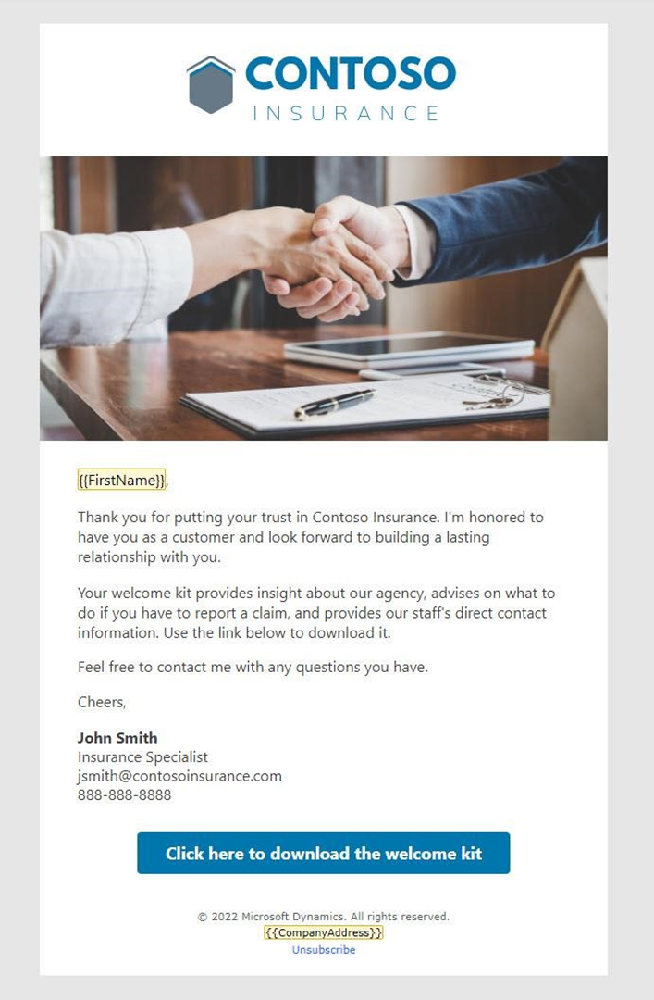

---
lab:
  title: 'Laboratorio 1: Creación de correos electrónicos'
---

## Laboratorio 1: Creación de correos electrónicos 

Estos son los objetivos del laboratorio:
- Crear correos electrónicos para usar en un recorrido
- Usar recursos cargados en un correo electrónico
- Comprobar el contenido del correo electrónico y publicar

### Tarea 1: Crear tu primer correo electrónico
1. Inicia sesión en Dynamics 365 Customer Insights - Journeys.

1. Ve al área de trabajo **Recorridos en tiempo real**.

1. En Canales, selecciona **Correos electrónicos.**

1. Crea el correo electrónico.
   - Haz clic en **+ Nuevo** para crear un correo electrónico nuevo.
   - En la galería de plantillas, selecciona **omitir.**

1. Escribe los detalles sobre el correo electrónico.
   - Nombre: Correo electrónico de bienvenida 1
   - Asunto: Bienvenido a Contoso Insurance
   - Texto de vista previa: Nos comprometemos a proporcionar un seguro de calidad.

1. Selecciona el perfil de marca predeterminado como perfil de marca.

1. Ve a **Configuración** y expande **Cumplimiento.** Asegúrate de que el propósito está establecido en **Comercial.**

1. Diseña el correo electrónico. Consulta la captura de pantalla del correo electrónico de bienvenida 1 siguiente para obtener ideas de diseño y contenido, con la imagen principal que cargaste en las instrucciones de configuración. Puedes modificar las imágenes y el contenido según sea necesario, pero querrás incluir un botón de llamada a acción en este correo electrónico, ya que se usará como criterio de diversificación dentro del recorrido.

 

1. Esta es una copia de muestra para este correo electrónico. Puedes copiarla y pegarla en tu diseño de correo electrónico. Usa **Personalización** para escribir contenido dinámico para el nombre del contacto. 

    ```
    {{FirstName}},
    
    Thank you for putting your trust in Contoso Insurance. We're honored to have you as a customer and look forward to building a lasting relationship with you. 
 
    As America's \#1 insurance company, we're committed to providing quality insurance that protects all aspects of your business. 
 
    We've put together a welcome kit that provides insight about our agency, advises on what to do if you need to report a claim, and provides our staff's direct contact information. Use the link below to download it. 
 
    Feel free to contact us any time at 888-888-8888 with any questions you have. And don't forget to download our mobile app where you can view your account history, pay your bill, and more. 
    ```

1. Agrega un botón al correo electrónico. 

    - En el Cuadro de herramientas, selecciona la pestaña **Elementos**. 
    - Arrastra un botón debajo del texto principal. 
    - Cambia la dirección URL a contoso.com. 
    - Expande la sección Estilo. 
    - Cambia el color del botón a #0076ad. 

1.  Previsualiza, prueba y publica el correo electrónico. 

    - Ve a la pestaña **Vista previa y prueba** del correo electrónico para revisar el correo electrónico. 
    - Usa **Envío de prueba** para enviarte una copia. Escribe tu dirección de correo electrónico personal. Selecciona el contacto que creaste anteriormente: la personalización rellenará el nombre de este contacto. Si no ves el correo electrónico en tu bandeja de entrada, asegúrate de comprobar las carpetas de correo no deseado. 
    - Realiza los cambios finales. 
    - Haz clic en **Comprobar contenido**. Corrija cualquier error, si es necesario. 
    - Haz clic en **Listo para enviar.** 

### Tarea 2: Crear tu segundo correo electrónico
Crearemos dos correos electrónicos más. Para ello copiaremos el correo electrónico que acabas de crear.

1. Con el correo electrónico de bienvenida 1 abierto, haz clic en la lista desplegable situada junto a **Guardar** y selecciona **Guardar como.**

1. Actualiza el nombre del correo electrónico a **Correo electrónico de bienvenida 2**. 

1. Haga clic en **Guardar y cerrar**.

1. Selecciona **Ver registro** en el menú emergente para pasar al correo electrónico recién creado. (Si no aparece, ve a **Correos electrónicos** y selecciona **Correo electrónico de bienvenida 2**.)

1. Cambia el asunto y el texto de vista previa.
    - **Asunto** sugerido: Obtenga acceso a petición al portal de Contoso Insurance.
    - **Texto de vista previa** sugerido: Revise la información de la cuenta, los detalles de la directiva, envíe una notificación, etc.

1. Diseña el correo electrónico. Consulta la captura de pantalla del correo electrónico de bienvenida 2 a continuación para obtener ideas de diseño y contenido. Puedes modificar las imágenes y el contenido según sea necesario. 

 

1. Esta es una copia de muestra para este correo electrónico. Puedes copiarla y pegarla en tu diseño de correo electrónico. (Nota: se recomienda dejar FirstName del primer correo electrónico y, a continuación, reemplazar el resto de la copia por este). 

    ```
    I would like to welcome you to the Contoso family! Our specialists are here to help you with all your insurance needs. We also encourage you to setup your Contoso Insurance online account to gain 24/7 access to:  
        -   Your account information and policy details. 
        -   Submit a request for coverage verification, start a claim, or review prior claims. 
        -   A secure and encrypted internal messaging tool for sharing sensitive information. 
    Feel free to contact me with any questions you have. 
        
    Cheers, 
    John Smith, Insurance Specialist   jsmith@contosoinsurance.com 
    888-888-8888 

1. Preview, test, and go live with your email.

### Task 3: Create your third email
We will create one final email by copying email 2.

1. Create a new email by copying email 2. Name the email Welcome email 3. 

1. Enter details about the email.
    - Suggested **Subject:** Welcome to Contoso
    - Suggested **Preview text:** Review your welcome information.

1. Design the email. Refer to the screenshot of Welcome Email 3 below for design and content ideas. You can modify the images and content as desired. 

 

1. Here is sample copy for this email. You can copy and paste this into your email design. (Note: We recommend leaving FirstName from the first email and then replacing the rest of the copy with this.) 

    ```
    Gracias por confiar en Contoso Insurance. Es honor tenerle como cliente y espero establecer una relación duradera con usted. Su kit de bienvenida proporciona información sobre nuestra agencia, aconseja qué hacer si debe informar de una reclamación y proporciona la información de contacto directo de nuestro personal. 

    Use el vínculo siguiente para descargar el kit desde nuestro sitio web.
    
    Si tiene más preguntas, por favor, no dude en ponerse en contacto conmigo. Saludos, John Smith, Especialista en seguros jsmith@contosoinsurance.com 888-888-8888 

1. Actualiza el botón en el correo electrónico. En el campo **Texto del botón**, cámbialo por **Haga clic aquí para el kit de bienvenida.**

1. Previsualiza, prueba y publica el correo electrónico.
