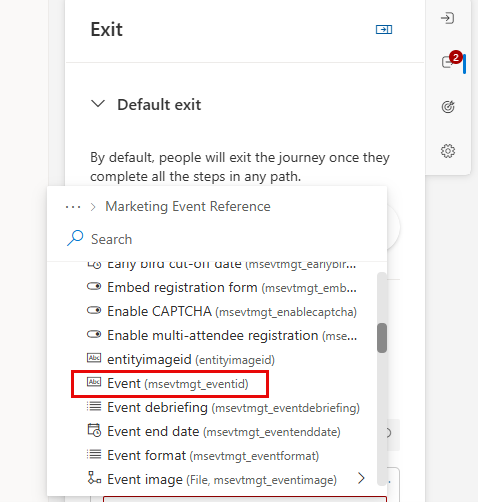

---
lab:
  title: 'Laboratorio 3: Creación de un recorrido basado en segmentos'
---
## Laboratorio 3: Creación de un recorrido basado en segmentos 

Estos son los objetivos del laboratorio:
- Creación de un recorrido basado en segmentos 
- Definición de los criterios de salida para el segmento 

### Tarea 1: Creación de un recorrido basado en segmentos 
Contoso quiere interactuar con los clientes que cumplen criterios demográficos específicos. Para ello, crearán un recorrido basado en segmentos.

1. En Involucración, selecciona **Recorridos**.

1. Haz clic en **+ Nuevo recorrido** en la barra de comandos.

1. Selecciona **Omitir y crear desde cero.**

1. En Nombre del recorrido, escribe **Seattle Campaign.**

1. En Elegir tipo de recorrido, selecciona **Basado en desencadenadores.**

1. En Seleccionar un segmento, elige **Seattle Customers.**

1. En Seleccionar la frecuencia, elige **Un recorrido repetido en el que todos los miembros de la audiencia repitan el recorrido cada:**

1. Selecciona **6 semanas.**

1. Establece la zona horaria en tu zona horaria.

1. Establece la fecha de inicio en la fecha actual, dentro de 30 minutos.

1. Establece la fecha de finalización en aproximadamente seis meses a partir de hoy.

1. Haz clic en **Crear**.

1. En la configuración del recorrido de la derecha, asegúrate de que está seleccionada la sección **Entrada**.

1. Ve a **Excluir por segmentos** y selecciona **Business Customers.**

### Tarea 2: Definición de los criterios de salida del recorrido
Dado que el objetivo del recorrido es impulsar a las personas a registrarse para un evento de marketing, queremos asegurarnos de que una vez que se registren, independientemente de dónde se encuentren en el recorrido, que este termine para ellos.  Además, si algún empleado de Contoso vive en Seattle, queremos que conozcan el próximo evento; sin embargo, no queremos que realicen el recorrido. Por esta razón, limitaremos quién puede continuar el recorrido.  

1.  Selecciona la sección **Salir**.  

1.  En **Salir cuando ocurra un desencadenante**, selecciona **Registro de evento de marketing creado.**

1.  Selecciona **Agregar condición.**

1.  Expande **Registro de evento de marketing creado** y, a continuación, expande **Referencia de evento de marketing.**

1.  Selecciona **Evento.**

    

1.  Establece el operador como **Equals.**

1.  Establece el valor en **Ted Contoso.**

1. En **Salir por segmentos**, establece el valor en **Contoso Customers.** Tus criterios de salida deben parecerse a la imagen siguiente.

    

### Tarea 3: Creación del recorrido
Ahora que hemos definido los distintos criterios relacionados con este recorrido, vamos a crear el recorrido.  

1. En el diseñador de recorridos, haz clic en el **icono más (+)** en el icono Contacto creado.

1. Selecciona **Rama de atributo (Rama basada en un valor específico).**

1. En Nombre para mostrar a la derecha, denomina el attrivute **New Business Customer.**

1. Selecciona **Rama 1** y en Elegir un atributo, busca **Descripción (descripción)** en **Contacto**.

1. Cambia el valor de Equals a **Contains.**

1. En Valor, escribe **Business**.

1. Haz clic en el **icono más (+)** en Rama 1.

1. Selecciona **Correo electrónico: Enviar un correo electrónico.**

1. En Seleccionar correo electrónico, elige **Welcome Email 1.**

1. Haz clic en el **icono de más (+)** en el icono Enviar un correo electrónico.

1. Selecciona **Esperar desencadenador.**

1. En el panel de rama If/then de la derecha, en Esperar, elegir un tipo de condición de rama selecciona **El mensaje anterior obtiene una interacción.**

1. En Elegir una interacción, selecciona **Se ha hecho clic en el vínculo del correo electrónico.**

1. En **¿Cuál es el límite de tiempo?,** escribe 10 minutos.

1. De nuevo, en el diagrama del recorrido, selecciona **crear ramas** para especificar el vínculo en el que se hace clic.

1. Selecciona el atributo **Se ha hecho clic en el vínculo del correo electrónico.**

1. En Rama 1, Elegir un vínculo, selecciona el botón de llamada a la acción del correo electrónico.

1. Debajo del botón de la ruta en la que se ha hecho clic, haz clic en el **icono más (+).**

1. Selecciona **Enviar un correo electrónico**.

1. En Seleccionar correo electrónico, elige **Welcome Email 2.**

1. En la ruta de acceso No correspondiente, haz clic en el **icono más (+).**

1. Selecciona **Enviar un correo electrónico**.

1. En Seleccionar correo electrónico, elige **Welcome Email 3.**

1. Guarda el recorrido.

1. Revisa el recorrido. Realiza los cambios finales.

1. Haz clic en **Publicar**. Espera a que se publique el recorrido.

